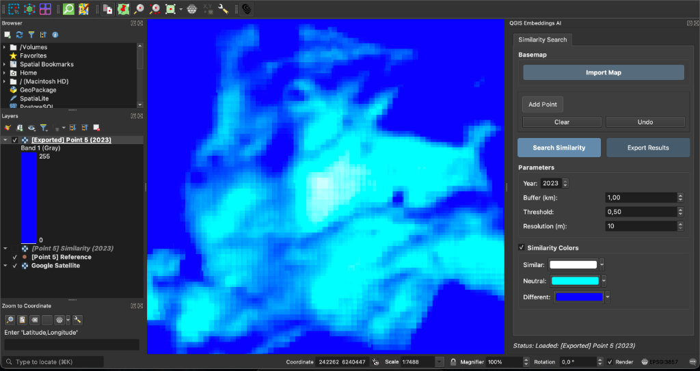
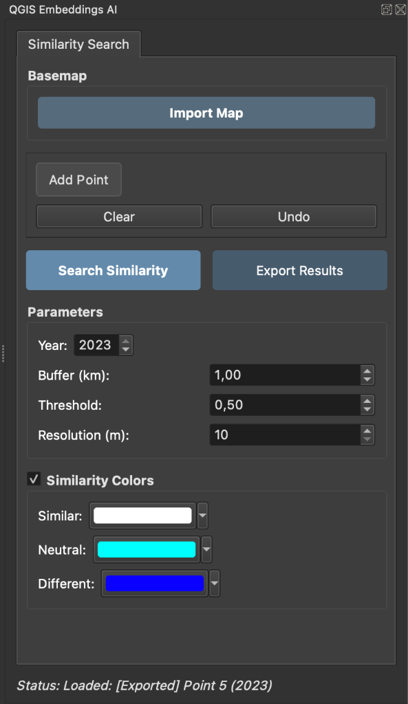

# QGIS Embeddings AI

> A QGIS plugin that unlocks the power of geospatial foundation models for advanced spatial analysis

<br>


<br>





<br>

---

<br>

## 🌍 What are Geospatial Foundation Models?

Foundation models are **large-scale AI systems pre-trained on massive geospatial datasets**. They learn universal representations of Earth's surface that can be adapted to countless analysis tasks.

<br>

### How they work

**Training**  
Models are trained on petabyte-scale datasets combining satellite imagery (optical + radar), elevation data, climate variables, and text from Wikipedia and biodiversity databases.

**Embeddings**  
The model converts each location into a **64-dimensional vector** — a compact mathematical fingerprint encoding land cover patterns, seasonal dynamics, spatial context, and semantic meaning.

**Applications**  
These embeddings enable similarity search, zero-shot classification, multi-modal fusion, and text-to-map queries.

<br>

### Why embeddings?

Embeddings provide **16x data compression** while preserving information, enable instant analysis through pre-computed representations, support one model for many tasks, and work anywhere on Earth across sensors and time periods.

<br>

---

<br>

## 📦 Supported Foundation Models

**AlphaEarth** by Google DeepMind  
General-purpose Earth observation foundation model trained on petabyte-scale geospatial data

<br>

---

<br>

## ✨ Features

**Point-based similarity search** with configurable search radius (0.5 to 100 km)

**Year selection** from 2017 to 2023

**Visual similarity heatmaps** with color-coded results (green = similar, red = different)

**Google Satellite basemap** integration for reference imagery

<br>

---

<br>

## 📋 Requirements

**QGIS 3.28 or higher**

**Google Earth Engine Plugin** installed from QGIS Plugin Manager

**Google Cloud Project** with Earth Engine API enabled

**GEE Authentication** connected and authenticated

<br>

---

<br>

## 🚀 Installation

### From QGIS Plugin Manager

Open QGIS → **Plugins** → **Manage and Install Plugins**  
Search for **"QGIS Embeddings AI"**  
Click **Install**

### Manual Installation

Download or clone this repository

Copy the folder to your QGIS plugins directory:
- macOS: `~/Library/Application Support/QGIS/QGIS3/profiles/default/python/plugins/`
- Windows: `%APPDATA%\QGIS\QGIS3\profiles\default\python\plugins/`
- Linux: `~/.local/share/QGIS/QGIS3/profiles/default/python/plugins/`

Restart QGIS and enable the plugin in **Plugins** → **Manage and Install Plugins**

<br>

---

<br>

## 📖 Usage

**1. Launch the plugin**  
Click the QGIS Embeddings AI icon in the toolbar

**2. Import a basemap** (optional)  
Use the "Import Map" button for reference imagery

**3. Select a reference location**  
Click "Add Point" and select a point of interest on the map

**4. Configure search parameters**
- Year: Satellite data year (2017-2023)
- Buffer: Search radius in kilometers
- Threshold: Maximum dissimilarity (0-1)
- Resolution: Output resolution in meters

**5. Run similarity search**  
Click "Search Similarity" and wait for results

**6. Interpret results**  
A new raster layer shows similarity where green indicates high similarity, yellow medium, and red low similarity

<br>

---

<br>

## 🔧 Technical Details

### AlphaEarth Architecture

Vision Transformer with **STP blocks** (Space-Time-Precision) processing 10m resolution imagery from Sentinel-2, Landsat, SAR, DEM, ERA5, and text sources. Outputs **64-dimensional unit vectors** on a hypersphere using von Mises-Fisher distribution. Trained via self-supervised contrastive learning on petabyte-scale data. Similarity measured by **Euclidean distance** in embedding space.

### Data Flow

```
User selects point → Extract mean embedding → Calculate distance → Visualize heatmap
```

<br>

---

<br>

## 👤 Author

**Lilien Auger**  
[LinkedIn](https://www.linkedin.com/in/lilien-auger/)

<br>

## 📄 License

GPL-3.0 License — See LICENSE file for details

<br>

## 🙏 Acknowledgments

Google DeepMind for AlphaEarth  
Google Earth Engine team  
QGIS community
